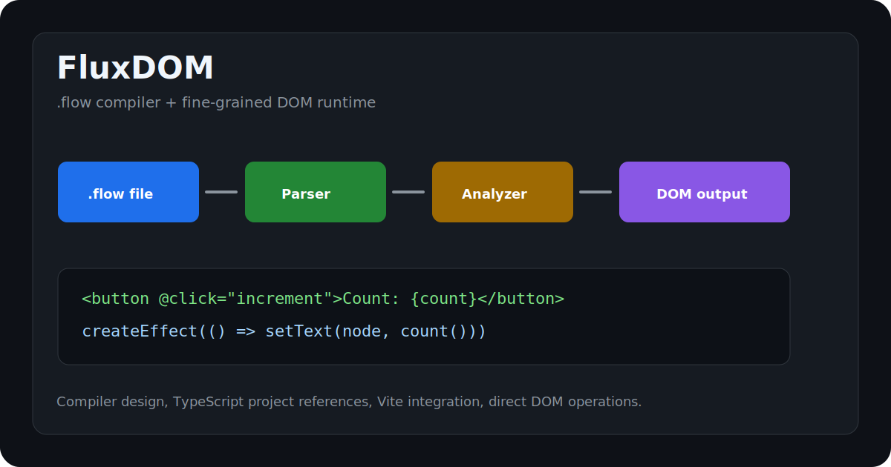

# FluxDOM

Experimental `.flow` component compiler and fine-grained DOM runtime.



[Live website](https://fluxdom-6e1gb0.v2.appdeploy.ai/) · [GitHub repository](https://github.com/onuracar-dev/FluxDOM)

FluxDOM explores a compiler-first frontend model: parse a single-file
component, analyze its behavior, generate direct DOM operations, and let small
signals update only the values that depend on them.

> **Status:** a pre-1.0 engineering prototype, not a production framework.
> Syntax, generated output, SSR behavior, and package APIs can change.

## Try the starter

After the packages are available on npm:

```bash
npx @fluxdom/cli create my-flow-app
cd my-flow-app
npm install
npm run dev
```

For repository development:

```bash
npm ci
npm test
npm run build
npm run dev --workspace hello-world
```

## Component example

```html
<script lang="ts">
  let items = ['compiler', 'signals'];
  let visible = true;
</script>

<template>
  {#if visible}
    <ul :class="items.length > 1 ? 'ready' : ''">
      {#each items as item, index}
        <li>{index}: {item}</li>
      {/each}
    </ul>
  {/if}
</template>

<style scoped>
  li { color: rebeccapurple; }
</style>
```

The parser validates nesting and reports filenames for malformed tags or
directives. Nested `if`/`each`, reactive attributes, events, expressions, and
scoped style markers are covered by fixtures. The Vite plugin now imports its
virtual CSS output, so component styles are included in application builds.

## Packages

| Package | Current scope |
| --- | --- |
| `@fluxdom/compiler` | `.flow` parser, analysis, and prototype code generation |
| `@fluxdom/runtime` | Signals, effects, batching, and direct DOM helpers |
| `@fluxdom/vite-plugin` | `.flow` transforms, virtual CSS, and safe static SSR helper |
| `@fluxdom/server` | Escaped static serialization and explicit server DOM operations |
| `@fluxdom/router` | Route matching and browser navigation signals |
| `@fluxdom/store` | Signal-backed stores with browser persistence |
| `@fluxdom/cli` | Working project scaffold plus local Vite wrappers |

The DevTools experiment remains private because its panel and asset packaging
are not ready for independent distribution.

## Supported boundary and known limitations

- The script transform recognizes a deliberately small top-level `let` subset;
  it is not a general JavaScript/TypeScript AST transform yet.
- `{#each}` rerenders its block when the collection signal changes. It does not
  perform keyed reconciliation.
- `{#if}` uses a display wrapper rather than structural mount/unmount semantics.
- Scoped CSS handles ordinary flat selectors. Complex nested at-rules and
  `:global(...)` behavior need broader fixture coverage.
- Hydration is currently destructive client rerendering.
- Static SSR never evaluates component source. Dynamic templates return a
  client-render mount point; full SSR is not implemented.
- Router mounting, nested routes, lifecycle hooks, source maps, and fine-grained
  HMR remain roadmap work.

Do not compile and execute untrusted `.flow` source. See [SECURITY.md](./SECURITY.md).

## Architecture

```text
.flow source
  -> structural parser
  -> static analysis
  -> script/template/style transforms
  -> direct DOM runtime calls + virtual CSS module
  -> Vite bundle
```

FluxDOM and NimbleJS intentionally remain independently versioned. Their shared
semantic boundary and revisit criteria are recorded in
[`docs/adr/0001-fluxdom-and-nimblejs-boundary.md`](./docs/adr/0001-fluxdom-and-nimblejs-boundary.md).

## Contributing and license

Read [CONTRIBUTING.md](./CONTRIBUTING.md). FluxDOM is MIT licensed.
